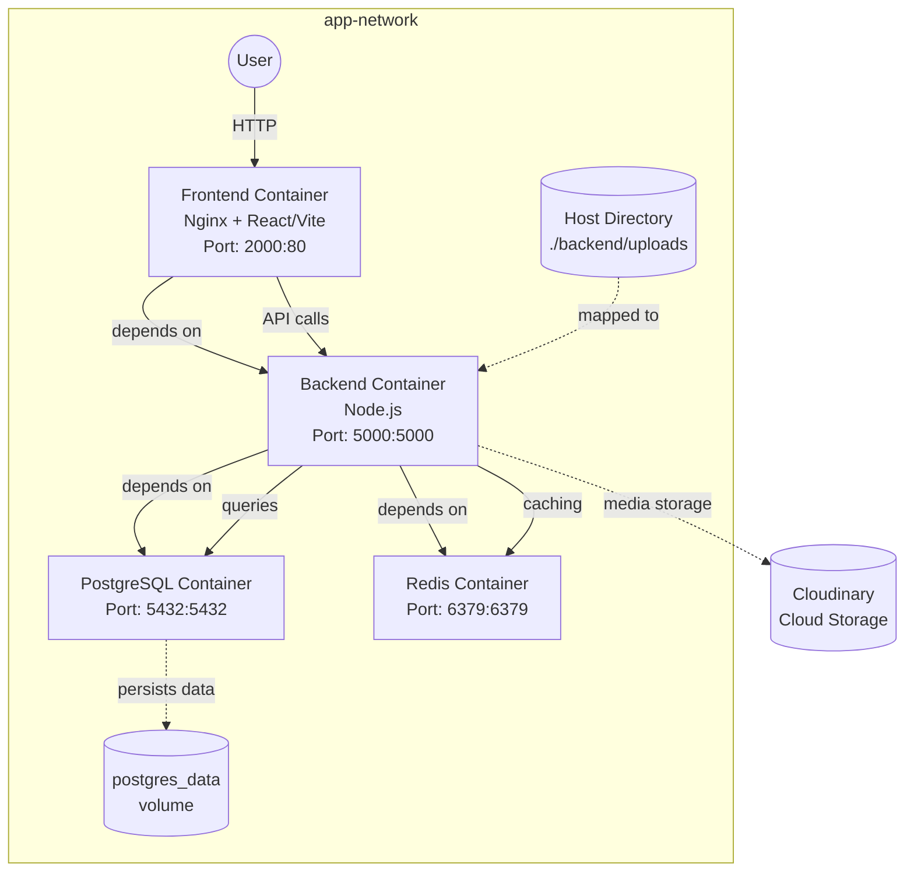

# Digilab-NG Deployment Topology

This diagram shows the deployment architecture of Digilab-NG using Docker containers and their interactions.

## Components

1. **Frontend Container**
   - Nginx serving React/Vite application
   - Port: 2000 (external), 80 (internal)
   - Depends on backend service

2. **Backend Container**
   - Node.js API server
   - Port: 5000
   - Depends on postgres and redis
   - Maps local uploads directory
   - Integrates with Cloudinary for media storage

3. **PostgreSQL Container**
   - Main database
   - Port: 5432
   - Uses persistent volume: postgres_data

4. **Redis Container**
   - Caching server
   - Port: 6379

5. **Host Directory Mapping**
   - Local path: ./backend/uploads
   - Container path: /app/uploads
   - Used for file uploads persistence

6. **External Services**
   - Cloudinary for cloud-based media storage

All services communicate through a Docker bridge network named 'app-network'.